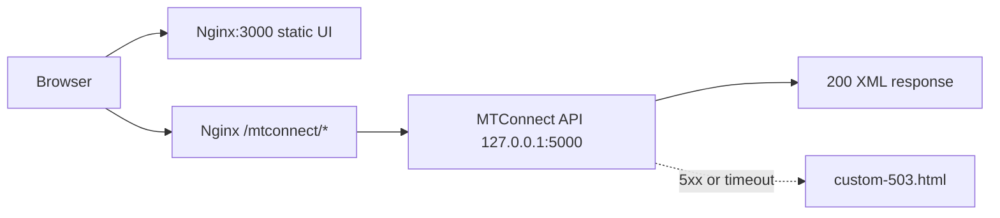

# React App Deployment on Linux with Nginx and MTConnect Proxy

  

This guide walks you through deploying the React app on Linux using Nginx, with reverse proxy to an MTConnect API at http://localhost:5000, including fallback behavior when the upstream is unavailable.

## Start Here

- First-time deployment: follow [Deployment Checklist](#deployment-checklist) and then [Step-by-Step Setup](#step-by-step-setup)
- Want architecture first: see [Request Flow](#request-flow)
- Hit an issue: jump to [Troubleshooting](#troubleshooting)

## Table of Contents

- [Prerequisites](#prerequisites)
- [Deployment Checklist](#deployment-checklist)
- [Step-by-Step Setup](#step-by-step-setup)
- [Nginx Site Configuration](#nginx-site-configuration)
- [Request Flow](#request-flow)
- [Verification](#verification)
- [Troubleshooting](#troubleshooting)
- [Optional Hardening](#optional-hardening)

## Prerequisites

- Linux machine (Debian/Ubuntu recommended)
- React app source code
- MTConnect API running at http://localhost:5000
- Port 3000 available for Nginx to serve the UI

## Deployment Checklist

- [ ] Install Nginx
- [ ] Build React app
- [ ] Copy build output to web root
- [ ] Add Nginx site configuration
- [ ] Enable site and reload Nginx
- [ ] Add API-down fallback page
- [ ] Verify UI and proxy endpoints

## Step-by-Step Setup

### 1. Install Nginx

```bash
sudo apt update
sudo apt install nginx
```

### 2. Build the React App

```bash
cd /path/to/react-app
npm install
npm run build
```

### 3. Deploy Build to Web Server Root

```bash
sudo rm -rf /var/www/html/*
sudo cp -r build/* /var/www/html/
```

### 4. Create Nginx Site File

```bash
sudo nano /etc/nginx/sites-available/react-app
```

Paste the configuration from [Nginx Site Configuration](#nginx-site-configuration).

### 5. Enable the Site and Reload

```bash
sudo ln -s /etc/nginx/sites-available/react-app /etc/nginx/sites-enabled/
sudo nginx -t
sudo systemctl reload nginx
```

### 6. Add Fallback Page

```bash
echo "<html><body><h1>MTConnect API is currently unavailable.</h1></body></html>" | sudo tee /var/www/html/custom-503.html
```

### 7. Open the UI

Visit http://localhost:3000

Expected behavior:

- React app loads from Nginx.
- Requests to /mtconnect/... are proxied to localhost:5000.
- If MTConnect is down, custom-503.html is served.

## Nginx Site Configuration

```nginx
server {
    listen 3000;
    server_name localhost;

    root /var/www/html;
    index index.html;

    location / {
        try_files $uri /index.html;
    }

    location /mtconnect/ {
        proxy_pass http://127.0.0.1:5000/;
        proxy_http_version 1.1;
        proxy_set_header Host $host;
        proxy_set_header X-Real-IP $remote_addr;

        add_header Access-Control-Allow-Origin *;
        add_header Access-Control-Allow-Methods "GET, OPTIONS";
        add_header Access-Control-Allow-Headers "*";

        proxy_connect_timeout 2;
        proxy_read_timeout 5;
        error_page 502 504 500 = /custom-503.html;
    }
}
```

<details>
<summary>Why try_files is required for React SPA routing</summary>

`try_files $uri /index.html;` ensures direct navigation to client-side routes still serves your app shell.

</details>

## Request Flow



## Verification

Run these checks after deployment:

```bash
sudo nginx -t
curl -I http://localhost:3000
curl -I http://localhost:3000/mtconnect/current
```

<details>
<summary>What good results look like</summary>

- `nginx -t` returns syntax ok and test is successful.
- UI endpoint returns HTTP 200.
- MTConnect proxy endpoint returns HTTP 200 when upstream is healthy.

</details>

## Troubleshooting

<details>
<summary>Nginx test fails</summary>

Re-open your site config, fix syntax issues, then run:

```bash
sudo nginx -t
```

</details>

<details>
<summary>UI loads but API calls fail</summary>

Verify MTConnect service is up at localhost:5000 and check proxy path mapping in `location /mtconnect/`.

</details>

<details>
<summary>Receiving fallback page unexpectedly</summary>

Inspect upstream availability and timeout settings (`proxy_connect_timeout`, `proxy_read_timeout`).

</details>

<details>
<summary>React routes return 404 on refresh</summary>

Confirm `try_files $uri /index.html;` exists under `location /`.

</details>

## Optional Hardening

<details>
<summary>Production recommendations</summary>

- Restrict CORS to known origins instead of `*`.
- Add TLS with certificates and redirect HTTP to HTTPS.
- Add access/error log monitoring.
- Add rate limiting for upstream protection if needed.

</details>

Deployment complete.
