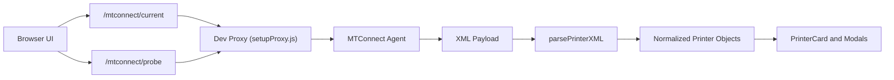

# Edge Dashboard

  

Edge Dashboard is a React application for monitoring MTConnect printer data in near real time. It polls MTConnect endpoints, parses XML into normalized printer objects, and presents device status in a dashboard UI.

## Start Here

- New contributor: [Quick Start](#quick-start)
- Environment setup: [Environment Variables](#environment-variables)
- Runtime architecture: [Data Flow](#data-flow)
- Parsing internals: [Printer Field Mappings](#printer-field-mappings) and [XML Utilities](#xml-utilities)
- Common issues: [Troubleshooting](#troubleshooting)

## Table of Contents

- [Quick Start](#quick-start)
- [Environment Variables](#environment-variables)
- [Development Proxy vs Production](#development-proxy-vs-production)
- [Scripts](#scripts)
- [Project Structure](#project-structure)
- [Features](#features)
- [Data Flow](#data-flow)
- [Printer Field Mappings](#printer-field-mappings)
- [XML Utilities](#xml-utilities)
- [Special Cases and Behavior Notes](#special-cases-and-behavior-notes)
- [Troubleshooting](#troubleshooting)
- [Security and Repo Hygiene](#security-and-repo-hygiene)
- [License](#license)
- [Contributing](#contributing)

## Quick Start

### Setup Checklist

- [ ] Install Node.js LTS (18 or newer recommended)
- [ ] Install dependencies
- [ ] Create local .env from template
- [ ] Set MTConnect host/port values
- [ ] Run the development server

### Commands

```bash
npm install
```

<details>
<summary>Create local .env file (expand by OS)</summary>

On Windows (PowerShell or cmd):

```bash
copy .env.example .env
```

On macOS/Linux:

```bash
cp .env.example .env
```

</details>

```bash
npm start
```

The app runs at http://localhost:3000.

<details>
<summary>Quick health check after startup</summary>

1. Open http://localhost:3000.
2. Confirm printer cards render.
3. If empty/error, check [Troubleshooting](#troubleshooting).

</details>

## Environment Variables

The app uses Create React App environment variables (must start with REACT_APP_):

- REACT_APP_MTCONNECT_HOST: MTConnect host used by dev proxy.
- REACT_APP_MTCONNECT_PORT: MTConnect port used by dev proxy.
- REACT_APP_API_POLLING_IN_MS: Polling interval in milliseconds.

Use .env.example as your starting point. It includes sensible defaults:

- REACT_APP_MTCONNECT_HOST=localhost
- REACT_APP_MTCONNECT_PORT=5000
- REACT_APP_API_POLLING_IN_MS=5000

## Development Proxy vs Production

In development, src/setupProxy.js proxies requests from:

- /mtconnect/current
- /mtconnect/probe

to:

- http://REACT_APP_MTCONNECT_HOST:REACT_APP_MTCONNECT_PORT

This proxy is only active with npm start.

For production deployment with Nginx reverse proxy, see [NginxDeployment.md](NginxDeployment.md).

## Scripts

- npm start: Start local dev server.
- npm run build: Create production build in build.
- npm test: Run tests.

## Project Structure

src/
- App.jsx: Root component, polling and data orchestration.
- setupProxy.js: Development-only API proxy.
- components/: Dashboard and modal UI components.
- hooks/: Custom hooks.
- styles/: CSS.
- utils/: XML parsing, mappings, helpers, polling utilities.

public/
- index.html: App host page.
- icons/: Icon assets.
- printerData*.xml: Sample XML payloads used for local reference/testing.

## Features

- Real-time printer cards using MTConnect XML data.
- Auto polling with configurable interval.
- Component stream detail modal.
- JSON detail modal for data items.
- Model-aware parsing behavior through mapping utilities.

## Data Flow



## Printer Field Mappings

File: [src/utils/printerFieldMappings.js](src/utils/printerFieldMappings.js)

### Overview

- This file exports field mapping tables that tell the parser where to read values from in MTConnect data items.
- singleValueFieldNamesByKey maps one UI field to a list of possible source keys, checked in order.
- multiValueFieldNamesByKey maps one UI field to multiple source keys so all matching values can be collected.

### Runtime Behavior

- parsePrinterXML in [src/utils/xmlUtils.js](src/utils/xmlUtils.js) uses these mappings to build the printer object shown in the UI.
- For single-value fields, the parser returns the first key that exists in the configured order.
- For multi-value fields, the parser reads every configured key that exists and returns the collected values.

## XML Utilities

File: [src/utils/xmlUtils.js](src/utils/xmlUtils.js)

### Overview

[src/utils/xmlUtils.js](src/utils/xmlUtils.js) is the XML parsing and value-normalization layer for printer data.

It is used to:

1. Convert MTConnect XML into a consistent printer object used by the UI.
2. Normalize time, duration, status, and JSON fields so components can render predictable values.
3. Apply model-specific parsing rules where data format differs by printer model.

Primary runtime usage:

1. [src/App.jsx](src/App.jsx) calls parsePrinterXML after fetching XML.
2. [src/components/PrinterCard.jsx](src/components/PrinterCard.jsx) uses parsed values and formatting helpers for display.
3. [src/components/ComponentStreamModal.jsx](src/components/ComponentStreamModal.jsx) uses underscore formatting for detailed data display.

### Function Reference

<details>
<summary>Expand full function reference table</summary>

| Function | Type | Purpose | Input | Output | Used In |
|---|---|---|---|---|---|
| formatStatusText | Exported | Makes underscore-separated status text easier to read in UI by adding line breaks after underscores. | text: string or null | string or original null/undefined | [src/components/PrinterCard.jsx](src/components/PrinterCard.jsx) |
| formatTimeToHHMM | Exported | Converts ISO time or epoch-seconds to HH:MM (24h). | timeString: string or number | HH:MM string, or original input when invalid | Not directly used in current UI flow |
| formatDateHHMM | Exported | Converts ISO time or epoch-seconds to M/D, HH:MM. | timeString: string or number | formatted date-time string, or original input when invalid | [src/utils/xmlUtils.js](src/utils/xmlUtils.js) return mapping |
| formatSecondsToHHMM | Exported | Converts seconds to HH:MM duration string. | timeString: string or number | HH:MM string, fallback string for invalid input | [src/utils/xmlUtils.js](src/utils/xmlUtils.js) return mapping |
| formatUnderscoreText | Exported | Splits underscore-separated text into multiple lines. | text: string | formatted string (empty string when nullish) | [src/components/ComponentStreamModal.jsx](src/components/ComponentStreamModal.jsx) |
| getJsonJobData | Exported | Safely parses JSON text; keeps fallback value when parsing fails. | msgValue: string or any | object, null, original value, or Invalid JSON text | [src/components/PrinterCard.jsx](src/components/PrinterCard.jsx), [src/utils/xmlUtils.js](src/utils/xmlUtils.js) |
| getPrinterModelByDeviceId | Exported | Resolves model name from printer code, with probe-based override for specific models. | printerCode, probeModels, deviceStreamName | model string (or empty string) | [src/utils/xmlUtils.js](src/utils/xmlUtils.js) |
| parsePrinterXML | Exported | Main XML parser. Builds final printer objects for UI cards and modals. | xmlText, opts with optional probeModels | array of normalized printer objects | [src/App.jsx](src/App.jsx) |
| getFieldValue | Internal | Returns first matching value for a single-value logical field; supports job_data JSON fallback. | field name | string or nested value | Internal to parsePrinterXML |
| getAllFieldValues | Internal | Returns all matching values for a multi-value logical field. | field name | array or single value | Internal to parsePrinterXML |
| resolvePrinterState | Internal | For SLS 380, maps numeric state values to readable text. For all other models, returns raw state unchanged. | printerCode, rawState | mapped SLS 380 state or original rawState | Internal to parsePrinterXML |
| getCurrentLayer | Internal | Gets current layer (or current_height for SLS 380 from job_data). | none | current layer value | Internal to parsePrinterXML |
| getMaterial | Internal | Gets material list, with SLS 380 job_data override if present. | none | material value or list | Internal to parsePrinterXML |
| getStartTime | Internal | Converts SLA 750 family start time from epoch-seconds to HH:MM UTC; otherwise uses formatted local date-time. | none | start time text | Internal helper currently not used in final return object |
| getProgress | Internal | For listed models, treats progress as 0-1 fraction and multiplies by 100. For other models, uses value as-is (already percent). | none | numeric or original progress value | Internal to parsePrinterXML |
| getPrinterName | Internal | Uses serial number as display name for specific model. | none | printer name string | Internal to parsePrinterXML |

</details>

## Special Cases and Behavior Notes

<details>
<summary>1. Unknown model filtering</summary>

- Only DeviceStream entries whose printer code exists in printerModelByCode are returned.
- Unknown codes are skipped.

</details>

<details>
<summary>2. Field fallback from job_data JSON</summary>

- When direct mapped keys are missing, getFieldValue can read nested values from build.job_data JSON.

</details>

<details>
<summary>3. SLS 380 state mapping</summary>

- For model 31006, numeric printer_state values are mapped to text using printer31006StateMap.
- For all other models, printer_state is passed through as-is.

</details>

<details>
<summary>4. SLS 380 current layer and material overrides</summary>

- Current layer can come from job_data.current_height.
- Material can come from job_data.material.

</details>

<details>
<summary>5. Progress scaling by model</summary>

- Some models publish progress as fraction (0-1). For those models, parser multiplies by 100.
- All other models are treated as already-percent values and are returned unchanged.

</details>

<details>
<summary>6. Model-specific printer name override</summary>

- For DMP Flex 350 Triple, serial number is used as display printer name.

</details>

<details>
<summary>7. Time parsing supports two formats</summary>

- Time helpers support both ISO date strings and epoch-seconds.

</details>

<details>
<summary>8. Duration rounding behavior</summary>

- formatSecondsToHHMM rounds minute remainder upward using ceiling.
- Example: 59 seconds becomes 00:01.

</details>

<details>
<summary>9. Unused internal helper</summary>

- getStartTime is defined inside parsePrinterXML.
- The final returned startTime currently uses formatDateHHMM(getFieldValue("startTime")) directly.

</details>

## Troubleshooting

<details>
<summary>Failed to load printers</summary>

Verify MTConnect host/port in .env and confirm the MTConnect agent is reachable.

</details>

<details>
<summary>No printer found</summary>

Confirm the /mtconnect/current endpoint returns DeviceStream entries with known model codes.

</details>

<details>
<summary>Proxy issues during development</summary>

Restart npm start after changing .env, because setupProxy reads environment values at server startup.

</details>

<details>
<summary>Build output serving stale data</summary>

Confirm reverse proxy caching behavior and MTConnect upstream health in your Nginx configuration.

</details>

## Security and Repo Hygiene

- Do not commit .env files with internal hosts or sensitive values.
- .env is git-ignored; use .env.example for shared configuration shape.

If .env was previously committed, remove it from tracking while keeping your local file:

```bash
git rm --cached .env
```

## License

This project is licensed under Apache 2.0. See [LICENSE](LICENSE).

## Contributing

1. Create a feature branch.
2. Keep commits small and focused.
3. Open a pull request with a clear summary and test notes.
